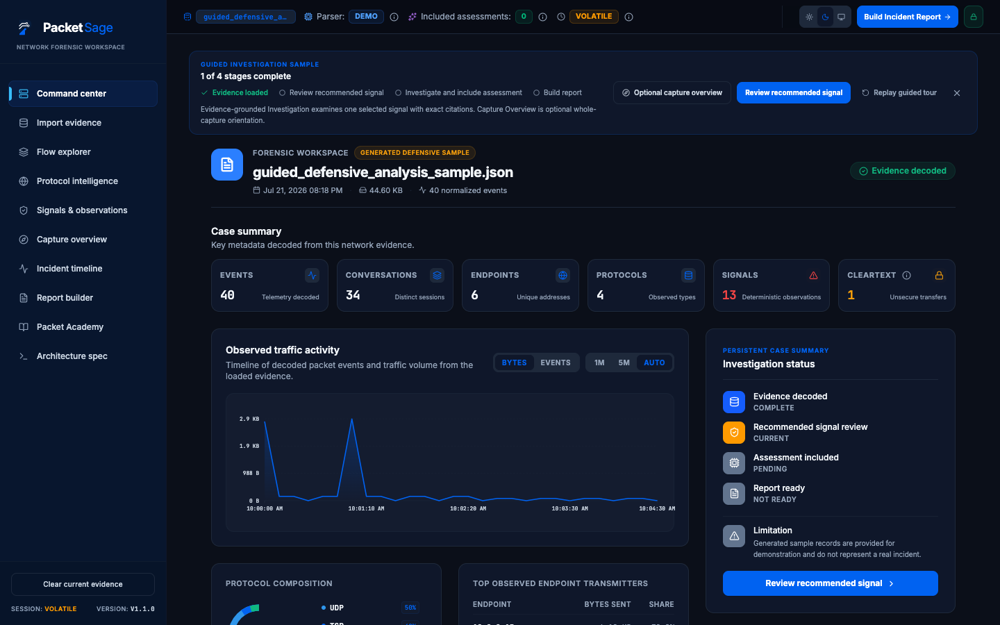
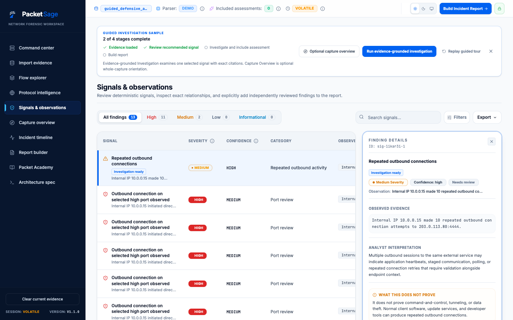
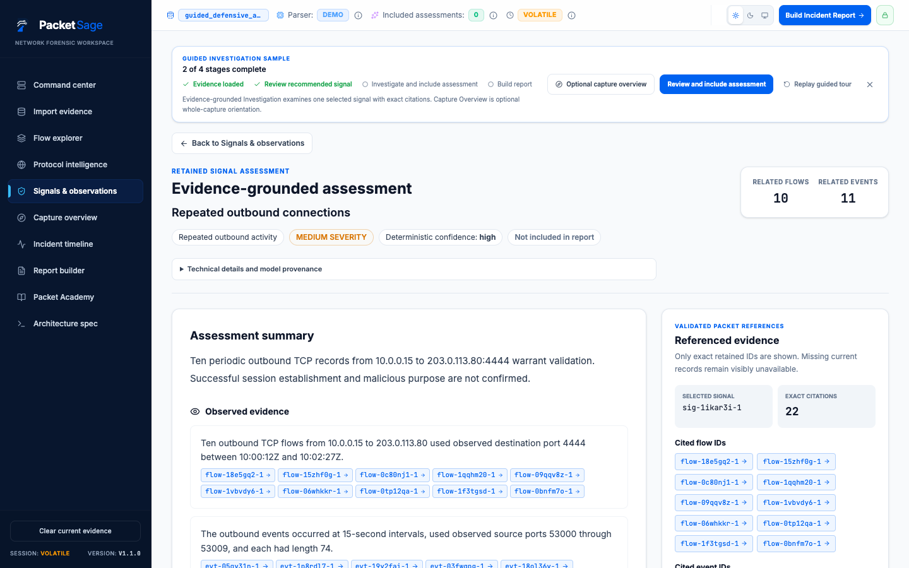
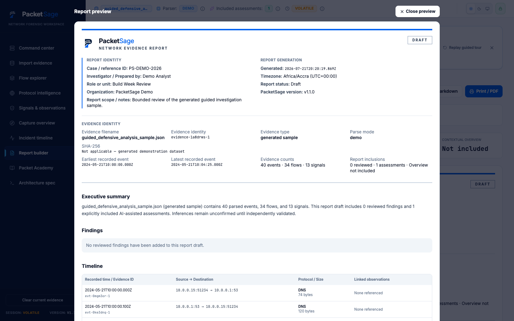
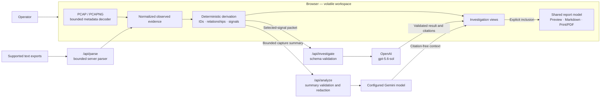

# PacketSage

> Evidence-grounded network investigation with deterministic signals, bounded AI assistance, exact citations, and user-controlled reporting.

PacketSage is an evidence-grounded network investigation workspace that helps analysts use AI without allowing inference to masquerade as observed fact. It is a **Developer Tools** project for defensive network forensics, packet analysis, incident response, and technical learning.

[**Open the live workspace**](https://packetsage.vercel.app) · **333/333 production tests** · **`build-week-stage-4a.2-production`** · **Proprietary/source-available**

Created and developed by **Prince Kofi Frimpong Amissah**.



## Why PacketSage exists

Packet tools expose large volumes of precise but fragmented technical evidence. Generic AI summaries can make that evidence easier to read, but they can also blur the line between a recorded fact and a model inference.

PacketSage keeps four layers visibly separate:

| Layer | Meaning |
| --- | --- |
| **Observed evidence** | Fields supplied by, or decoded from, authorized evidence |
| **Deterministic derivation** | Stable IDs, flows, protocol records, signals, and exact relationships |
| **External/contextual orientation** | Optional Capture Overview today; explicitly sourced enrichment in the future |
| **AI inference** | A bounded selected-signal assessment with validated citations |

> Observed evidence, deterministic derivation, external context and AI inference remain visibly separate.

PacketSage does not claim that packet evidence confirms compromise, malware, command and control, credential theft, or exfiltration. It helps an operator inspect the available evidence, document uncertainty, and decide what to verify next.

## Who it is for

- Security analysts and incident responders reviewing exported network evidence.
- SOC operators who need a compact evidence-to-report workflow.
- Students and educators learning packet analysis through a guided defensive sample.
- Developers reviewing network telemetry, parser behavior, and evidence provenance.

## Three-minute judge path

The generated sample provides a complete, non-sensitive walkthrough:

1. Select **Load guided investigation sample**.
2. Select **Review recommended signal**.
3. Select **Investigate with AI**. This is a deliberate provider-backed action; PacketSage never starts it automatically.
4. Select **Open full assessment** and inspect the labelled observation, inference, uncertainty, and next-step sections.
5. Open one exact flow or event citation, then return to the assessment.
6. Select **Include AI-assisted assessment in report**.
7. Select **Build report** or **Build Incident Report**.
8. Select **Preview** to inspect the report generated from the shared report model.

Every cost-generating AI request and every report-changing inclusion remains a user action. Capture Overview is optional and does not advance the evidence-grounded judge path.

## Shipped capabilities

### Evidence intake and bounded decoding

- Browser-local PCAP and PCAPNG metadata decoding within explicit byte and packet limits.
- Supported Ethernet, IPv4/IPv6, TCP, UDP, ICMP, and basic DNS paths.
- Server-parsed Wireshark CSV, Suricata EVE JSON, Zeek TSV/log exports, TShark JSON, and strict structured text.
- Safe rejection of malformed, truncated, oversized, or unsupported inputs without synthetic evidence.

### Deterministic investigation workspace

- Normalized events, flows, DNS/HTTP/TLS protocol records, and deterministic signals.
- Stable evidence identities, including occurrence handling for repeated visible records.
- Exact event, flow, protocol-record, and signal relationships across the workspace.
- Explicit `observed`, `unknown`, and `not-applicable` port provenance.

### Evidence-grounded investigation

- One deliberately selected signal is submitted through the server-only OpenAI route using the verified runtime model **`gpt-5.6-sol`**.
- Its bounded packet contains only exact referenced flows, events, and supported protocol records—never raw captures, packet payloads, packet `info`, or unrelated capture content.
- Structured responses retain provider/model provenance and separate **Observed evidence**, **Analyst inference**, **Uncertainty / missing evidence**, and **Recommended next investigative steps**.
- PacketSage accepts citations only when the referenced ID was supplied in the packet. Unsupported citations are removed without substitution.
- Cancellation, request identity, and evidence identity prevent stale or out-of-order completions from replacing the current assessment.

### Separate Capture Overview

- Optional whole-capture orientation from a separately bounded summary.
- Beginner and technical perspectives, traffic-pattern explanation, and triage questions.
- Citation-free contextual output that cannot create or change deterministic findings.
- Separate explicit **Include overview as contextual note** action.
- Uses the configured server-side Gemini model; every retained result records its actual provider and model provenance.

### Exact navigation and professional reporting

- Flow and event citations open only the exact referenced record, with unrestricted navigation recoverable afterward.
- Deterministic findings require review; GPT assessments and Capture Overview notes have separate explicit inclusion controls.
- One report model powers the on-screen document, **Preview**, **Copy Markdown**, and **Print / PDF**.
- Reports retain evidence identity, timestamps, exact references, labelled inference, model provenance, and limitations.

### Accessible investigation and learning

- Keyboard-operable primary rows, cards, citations, controls, dialogs, and contextual tour.
- Responsive navigation and evidence views at approximately 390 px without global horizontal overflow.
- Light, dark, and system themes.
- Packet Academy lessons and an in-product Architecture Spec that distinguish current behavior from future direction.
- **Architecture Spec**: Shows the implemented browser, serverless and model-provider boundaries, enforced limits, evidence-to-report pipeline, and explicitly unimplemented future systems. It remains available before evidence is loaded.







## Supported evidence and enforced boundaries

| Input or boundary | Current production behavior |
| --- | --- |
| PCAP / PCAPNG | Decoded in bounded browser memory; maximum 10 MiB and 20,000 packets |
| Text evidence | Parsed server-side; maximum 2,000,000 characters and 10,000 records, within a 3 MiB request body |
| Investigation packet | Maximum 128 KiB, 25 flows, 200 events, and 50 protocol records |
| Report timeline | Up to 100 normalized event rows |
| Raw capture bytes | Never sent to either model route |
| Packet payloads | Not reconstructed and never sent to either model route |
| Active case state | Volatile; cleared when evidence is replaced or the session is reloaded |

The native decoder intentionally does **not** perform TCP stream reassembly, decryption, payload reconstruction, full protocol dissection, or host-compromise confirmation. Unsupported data fails honestly rather than being guessed.

Strict structured text uses one event per line:

```text
YYYY-MM-DDTHH:mm:ssZ SRC_IP -> DST_IP [src_port=N] dst_port=N protocol=TCP|UDP length=N
```

The timestamp, valid IPv4 endpoints, destination port, protocol, and length are required. Ports may be `0`–`65535`; an explicit zero is observed, while an omitted source port is unknown.

## Production architecture



Raw capture bytes remain on the browser capture path. The two model paths receive different bounded derived inputs and never share assessment state.

## Evidence-to-report workflow

```mermaid
flowchart LR
    Load["Load authorized evidence"] --> Normalize["Decode or parse<br/>normalized events"]
    Normalize --> Derive["Derive stable IDs,<br/>flows and exact relationships"]
    Derive --> Signal["Review deterministic signal"]
    Signal -->|"Deliberate request"| Assess["Bounded AI assessment"]
    Assess --> Validate["Validate schema<br/>and citation intersection"]
    Validate --> Inspect["Inspect evidence,<br/>inference and uncertainty"]
    Inspect -->|"Explicit inclusion"| Compile["Compile report"]
    Signal -->|"Reviewed finding"| Compile
    Compile --> Output["Preview · Markdown · Print/PDF"]
```



## Build Week 2026

### Before Build Week

The tagged `pre-build-week-2026` baseline already provided a browser investigation workspace with evidence import, flow/protocol/signal views, an incident timeline, Packet Academy, early reporting, responsive navigation, and an earlier whole-capture Gemini analysis capability. It did not yet provide the current deterministic evidence contract, native capture decoder, evidence-scoped GPT investigation, trusted inclusion lifecycle, or final report experience.

### Added or hardened during Build Week

- Deterministic evidence identities and exact parser-established relationships.
- Bounded native PCAP/PCAPNG metadata decoding and strict structured-text parsing.
- Evidence-grounded `gpt-5.6-sol` investigation with validated exact citations.
- Cancellation and stale-response isolation across evidence and signal changes.
- Explicit report inclusion and a separately bounded Capture Overview.
- Contextual guided tour, full assessment workspace, and exact-citation navigation.
- Professional report identity, Preview, Markdown, and verified Print/PDF output.
- Responsive and keyboard-accessible investigation workflows.
- Honest unknown-source-port rendering and explicit three-state port provenance.
- Adversarial review and regression growth to 333/333 tests.

The full chronology, audit findings, production tags, and model-role disclosure are recorded in [OpenAI Build Week 2026](./docs/OPENAI_BUILD_WEEK_2026.md).

## Run locally

Requirements: a current Node.js installation and npm.

```bash
npm ci
cp .env.example .env.local
npm run dev
```

Open `http://127.0.0.1:3000`.

The guided sample and deterministic workspace do not require provider credentials. Optional runtime AI capabilities require server-side configuration:

```env
OPENAI_API_KEY=your_server_side_key
GEMINI_API_KEY=your_server_side_key
```

Never use `VITE_OPENAI_API_KEY` or `VITE_GEMINI_API_KEY`; `VITE_` variables are browser-exposed by Vite.

## Verify

```bash
npm test
npm run lint
npm run build
npm audit
npm audit --omit=dev
```

The frozen `build-week-stage-4a.2-production` baseline passed 333/333 tests. Future branches should report their own actual totals rather than assume this number.

## Known limitations

- Capture decoding is intentionally bounded and metadata-focused.
- PacketSage does not reassemble TCP streams, decrypt traffic, reconstruct payloads, or perform full protocol dissection.
- There are no accounts, persistent cases, collaboration features, SIEM integrations, or enterprise chain-of-custody controls.
- Active evidence and report state is volatile. Limited interface preferences may persist locally, while hosting and provider retention policies remain external.
- AI routes depend on configured provider access and can fail or time out without generating fallback findings.
- Model output is labelled assistance, not observed evidence, and still requires analyst verification.
- PacketSage is an authorized defensive-analysis workspace, not a live scanner or court-ready evidence vault.

## Future direction

- Bounded Evidence Query with exact cited answers.
- Identity, access control, durable cases, and version history.
- Provenance-labelled external context and review collaboration.
- Scalable capture processing and integrations without weakening evidence boundaries.

See the [Roadmap](./docs/ROADMAP.md) for sequencing, dependencies, and explicitly non-committed research directions.

## Documentation

- [OpenAI Build Week 2026](./docs/OPENAI_BUILD_WEEK_2026.md)
- [Technical Specification](./docs/TECHNICAL_SPEC.md)
- [Security and Privacy Model](./docs/SECURITY_PRIVACY_MODEL.md)
- [User Guide](./docs/USER_GUIDE.md)
- [Roadmap](./docs/ROADMAP.md)
- [Contributing](./CONTRIBUTING.md)
- [License](./LICENSE)

## License and use

PacketSage is proprietary and source-available, not open source. Public repository access supports transparency, evaluation, portfolio review, and contribution screening. Copying, redistribution, commercial use, hosted reuse, rebranding, or derivative products require prior written permission from the creator. See [LICENSE](./LICENSE) and [CONTRIBUTING.md](./CONTRIBUTING.md).
