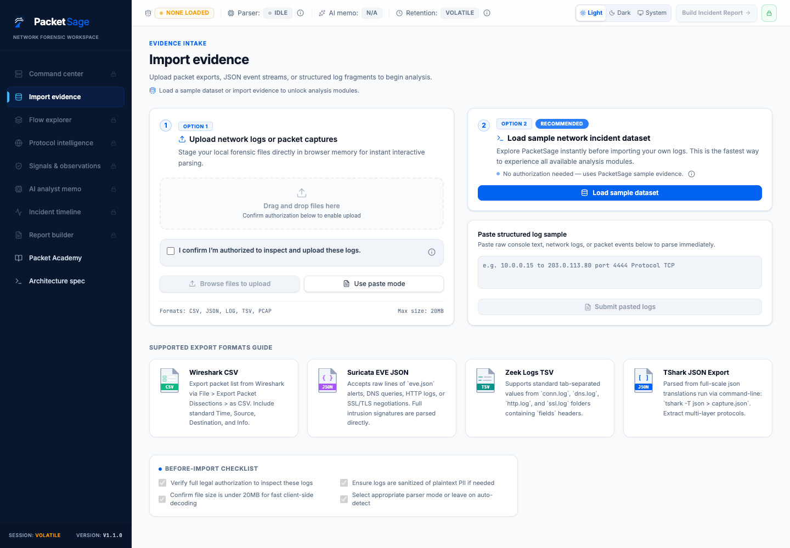
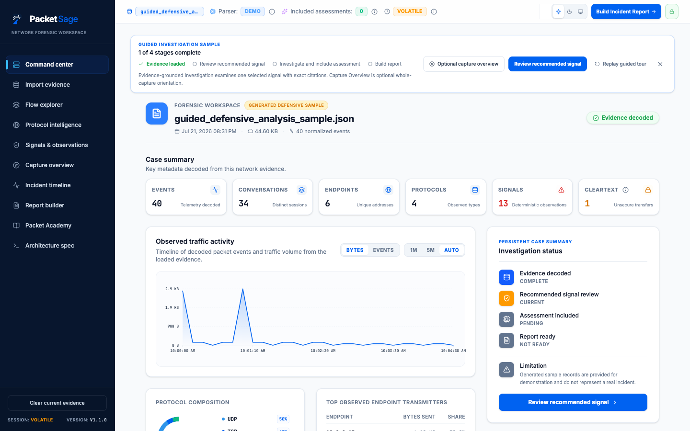
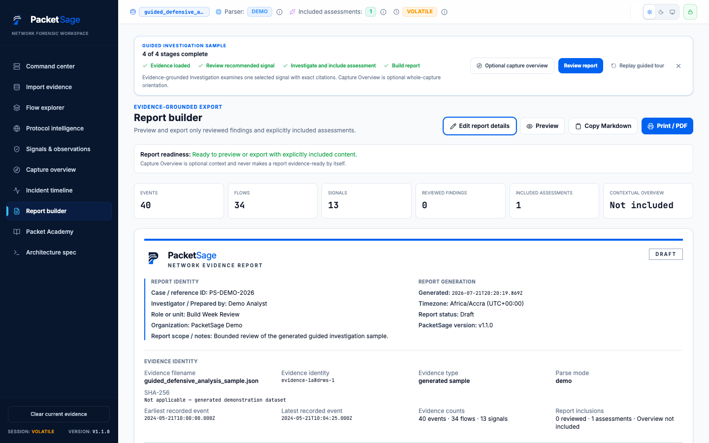

# PacketSage

PacketSage is a defensive network forensics sandbox for reviewing packet exports, decoded telemetry, protocol behavior, evidence-linked observations, AI-assisted analyst memos, incident timelines, and report-ready investigation notes.

It is built for security analysts, incident responders, students, and SOC operators who need a structured workspace for passive packet review. PacketSage ingests text-based packet logs, Wireshark CSVs, Suricata EVE alerts, Zeek summaries, and demo PCAP-style metadata, then reconstructs flows, highlights review-worthy observations, and helps draft evidence-bound reports.

## License & Use

PacketSage is proprietary and source-available, not open source. Public access to this repository is for transparency, review, portfolio, and collaboration screening only. Copying, redistribution, commercial use, hosted reuse, rebranding, or derivative products require prior written permission from the repository owner. See [LICENSE](./LICENSE) and [CONTRIBUTING.md](./CONTRIBUTING.md).

## Product Preview

<p align="center">
  
</p>

<p align="center">
  
  
</p>

---

## 🚀 Core Positioning & Boundaries

To ensure professional forensic integrity, PacketSage operates on a strict **Evidence-First, AI-Second** engineering model. It is designed around the following boundaries:

* **Defensive Analyst Workspace**: PacketSage is designed for defensive posture review and instructional forensics. It is **not** an active malware detector or breach containment system.
* **Browser-Side Forensic Sandbox**: All session telemetry and parsing happen ephemerally in-memory. It is **not** a court-ready forensic evidence vault.
* **Evidence-Bound Assistant**: The AI-assisted memo generator is strictly constrained to the ingested dataset. It acts as a drafting helper and **does not** replace human validation, final judgment, or active incident scoping.
* **Planned Production Decoder**: In sandbox mode, parsing is conducted using structured text imports (such as Wireshark CSVs and parsed summaries). Full native binary `.pcap`/`.pcapng` decoding is a planned enterprise target and is clearly indicated as a future architectural extension.

---

## 🛠️ Main Features & Functional Modules

1. **Command Center**: The home operations console. Provides a high-level summary of packet volumes, protocol distributions (TCP, UDP, ICMP), cleartext exposure risks, and quick access to top-severity signals.
2. **Import Evidence**: A versatile ingestion panel supporting drag-and-drop file imports or copy-paste text buffers for structured logs (CSV, TSV, JSON, raw strings).
3. **Flow Explorer**: An interactive session-reconstitution grid. Search and filter TCP/UDP conversations, calculate byte transfers, and drill down on packet sequences.
4. **Protocol Intelligence**: Separate investigative rails for key network applications:
   * *DNS Log*: Reconstructs lookup types (A, AAAA, TXT, MX) and queried domains.
   * *HTTP Traffic*: Examines unencrypted HTTP requests, request URIs, User-Agents, and credential exposure.
   * *TLS Metadata*: Extracts Server Name Indications (SNI) and certificate versions to compare encrypted session behaviors without decryption.
5. **Signals & Observations**: A deterministic rule engine that surfaces potential threat markers (e.g., scan patterns, unencrypted transfers, beaconing). Analysts can manually *Validate* or *Dismiss* these findings.
6. **AI Analyst Memo**: Synthesizes an executive narrative from parsed telemetry using a server-side Gemini API proxy, featuring executive analogies and defensive recommendations.
7. **Incident Timeline**: A clean, chronological timeline of reconstructed network events based on packet timestamps, with severity filters and detail modals.
8. **Report Builder**: A document compiler with a "Report Readiness Score" that tracks investigation completeness and compiles a print-optimized PDF/paper report.
9. **Packet Academy**: An instructional training suite containing guided multiple-choice challenges based on simulated capture profiles to evaluate defensive reasoning skills.
10. **Architecture Spec**: A transparent roadmap comparison of the current browser-side sandbox versus the planned production microservice architecture.

---

## 📦 Standard Data Models (TypeScript)

* **UploadedEvidence**: Tracks properties of the imported log/packet bundle (name, size, parseMode, upload timestamp).
* **FlowSummary**: Reconstructs TCP/UDP sessions between source and destination endpoints, detailing timestamps, volumes, and calculated risk indicators.
* **DnsRecord / HttpRecord / TlsRecord**: Normalized protocol-specific structures containing queried domains, requested paths, response codes, and certificate SNIs.
* **SuspiciousSignal**: Deterministic indicators computed on-the-fly (e.g., cleartext credentials, unusual inbound ports, data transfer spikes, scan patterns).
* **AiAnalysisResult**: Gemini's structured, schema-compliant summary.

---

## 🔒 Security & Privacy Model

* **Authorized Use Only**: Users must confirm authorization before importing custom logs. A pre-packaged simulated dataset is built-in for zero-credential training.
* **In-Memory Sandbox**: All evidence, parsed network records, and validation states are loaded ephemerally. Reloading or clicking "Clear Data" immediately wipes all records from browser and server memory.
* **Server-Side AI Proxy & Redaction**: To draft the AI memo, selected decoded metadata, packet volume metrics, port distributions, and triggered rules are submitted to a server-side Gemini API proxy. 
  * *No raw packet payloads* are transmitted to the proxy.
  * Credentials, JWT tokens, and sensitive headers are redacted locally on the client-side using regular expressions before transmission.
* **Passive Forensics**: PacketSage is purely passive. It does not perform active network port scans, host pings, or live interface sniffing.

---

## 💻 Running Locally

### 1. Install Dependencies
```bash
npm install
```

### 2. Configure Environment Variables
Create a `.env` file in the project root based on `.env.example`:
```env
GEMINI_API_KEY="your-gemini-api-key"
APP_URL="http://localhost:3000"
```
*(Note: Do not prefix `GEMINI_API_KEY` with `VITE_` to ensure it remains hidden from the browser).*

### 3. Run the Development Server
```bash
npm run dev
```

### 4. Access the Workspace
Open your browser and navigate to `http://localhost:3000`.

---

## 🗺️ Production Roadmap

* **Stage 1: Forensic Sandbox Workstation (Current)**:
  - Ephemeral browser-side workspace, text-based parser adapters, and deterministic rule engine.
  - Server-side Gemini proxy integration for analytical memos.
  - Report Builder with print-clean layouts.
  - Built-in Packet Academy.
* **Stage 2: Microservice-Based Binary Parser (Planned)**:
  - Containerized parsing using `libpcap`, `tshark`, `zeek`, and `suricata`.
  - Secure Cloud Storage buckets with signed short-lived URLs.
* **Stage 3: Workspace Authorization & Case Management (Planned)**:
  - Multi-tenant Firebase Authentication and Firestore persistent case storage.
