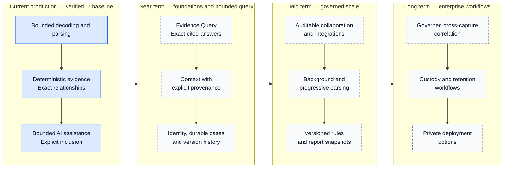

# PacketSage roadmap

PacketSage's roadmap extends a verified bounded investigation workspace without weakening the distinction between evidence and assistance.

> Observed evidence, deterministic derivation, external context and AI inference remain visibly separate.

This document describes direction, not a delivery contract. Items are not promises, release dates, committed vendors or guarantees of a particular future architecture.

## 1. Shipped production baseline

The production baseline is `build-week-stage-4a.2-production` at commit `e2d13e59c4fbf8f32e687110af3a91386af5d2ee`, verified with 333/333 tests. It already includes:

- bounded browser-side PCAP and PCAPNG metadata decoding for the implemented Ethernet, IPv4/IPv6, TCP, UDP, ICMP and basic DNS paths;
- bounded server parsing for Wireshark CSV, Suricata EVE JSON, Zeek TSV/log exports, TShark JSON and strict structured text;
- normalized events, flows, protocol records and deterministic signals with stable identities and exact relationships;
- explicit `observed`, `unknown` and `not-applicable` transport-port provenance;
- one-selected-signal Evidence-grounded Investigation using a bounded `gpt-5.6-sol` packet and validated exact citations;
- optional, separately bounded and citation-free Capture Overview;
- retained provider/model provenance and stale-response isolation for both model capabilities;
- explicit deterministic-review, assessment-inclusion and contextual-overview inclusion controls;
- a shared report model for screen, Preview, Markdown and Print/PDF;
- a contextual guided path, full assessment workspace, Incident Timeline, Packet Academy and in-product Architecture Spec; and
- keyboard-operable, responsive Light/Dark/System presentation.

These are current capabilities, not roadmap items. Current limitations remain intentional: no stream reassembly, decryption, payload reconstruction, authentication, durable cases, collaboration, SIEM integration or background processing for larger captures.

## 2. Near term

Near-term work should make evidence easier to interrogate while first establishing the identity and persistence foundations needed for trustworthy cases.

### Evidence Query over bounded normalized evidence

Add operator-initiated questions over bounded normalized records rather than raw capture bytes. Answers should cite only supplied evidence IDs, preserve the observed/derived/context/inference labels and fail without fabricated substitutions.

This capability should reuse current identity, relationship, port-provenance, cancellation and response-validation contracts. It must not become unrestricted evidence chat or an autonomous action surface.

### Exact cited answers

Extend current citation integrity from selected-signal assessments to bounded questions. Every retained reference should resolve to a current exact event, flow or supported protocol record. Unsupported references should be removed, not remapped to similar content.

### External context with explicit provenance

Allow deliberately requested contextual enrichment, such as documentation or threat-intelligence lookups, only as a visibly separate context layer. Each result should retain its source, retrieval time, applicable evidence identity and inclusion state. External context must not silently become observed packet evidence or alter deterministic findings.

### Case persistence

Design durable cases around the normalized evidence model, explicit schema versions and evidence identities. Persistence should be opt-in, encrypted and governed by clear lifecycle controls. Current volatile operation should remain an available privacy-preserving mode.

### Authentication and access control

Introduce identity before shared or durable case access. Authorization should be enforced server-side, with roles and case boundaries designed before any collaboration workflow. No provider or vendor has been selected by this roadmap.

### Durable audit and version history

Record explicit case changes, deterministic-rule versions, model-result provenance, inclusion decisions and report versions without rewriting the original normalized evidence. An audit history should make corrections visible rather than presenting mutable state as chain of custody.

## 3. Mid term

Mid-term work depends on the near-term identity, authorization and persistence foundations.

### Collaboration and review workflow

Support assignments, review decisions, comments and handoffs around exact evidence IDs and versioned report content. Collaboration should preserve authorship and distinguish human review from model generation.

### SIEM and SOC integrations

Provide bounded import and export contracts for defensive operations tools. Integrations should retain source-system identity, transformation provenance and safe failure rather than implying that PacketSage is itself a SIEM or autonomous SOC.

### Large-capture background processing

Evaluate isolated workers for captures beyond current browser bounds. Any design should use explicit resource quotas, cancellation, safe parser isolation and clear progress/error states. Larger capacity must not weaken current payload or provider boundaries.

### Progressive parsing

Explore incremental normalization and presentation while maintaining deterministic identity across chunks. Partial results must remain visibly partial, and later records must not silently change earlier evidence relationships without a versioned transition.

### Custom deterministic rules

Allow controlled rule authoring with version, author, input fields and resulting relationship provenance. Rule output should remain deterministic and separately labelled from external context and AI inference.

### Versioned report snapshots

Create immutable snapshots of the shared report model so reviewers can compare inclusion decisions and generated outputs over time. A snapshot should record provenance without being represented as a legal evidence seal.

## 4. Long term

Long-term directions require governance, scale and deployment work beyond the current single-session workspace.

### Cross-capture correlation

Relate evidence across authorized captures through explicit case and source boundaries. Correlation should expose why records were associated and retain uncertainty instead of manufacturing a single definitive incident narrative.

### Enterprise chain-of-custody workflows

Explore evidence receipt, custody events, access logging, integrity verification and organizational policy integration. PacketSage does not currently provide legal chain of custody, and a future workflow would require operational and legal review beyond technical hashes.

### Organization-wide investigation knowledge

Build governed reusable knowledge from reviewed cases, versioned rules and approved contextual sources. Tenant isolation, access control, retention and provenance must precede organization-wide reuse.

### Private or on-premise deployment

Evaluate private-cloud and on-premise operation for organizations with stricter network and data-residency requirements. This is a deployment option under research, not a current architecture guarantee.

### Enterprise retention and policy controls

Support configurable retention, legal holds, deletion workflows, model-access policies and evidence export under organization governance. No universal retention or regulatory-compliance claim is implied.

## 5. Intentionally deferred during Build Week

Build Week prioritized a narrow end-to-end trust path: authorized evidence becomes normalized records and deterministic signals; one signal can receive a bounded cited assessment; the operator decides what enters a report.

Evidence Query, external enrichment, accounts, durable storage, collaboration, integrations and large-capture infrastructure were deferred because they would have expanded the data and authorization architecture before the core evidence behavior was verified. Keeping them out of the event scope:

- protected browser/server/model trust boundaries;
- avoided broad, unaudited data access;
- kept every citation and navigation relationship exact;
- preserved deliberate model and report actions;
- made the judge path coherent and repeatable; and
- concentrated review effort on parsing, identity, cancellation, reporting and port provenance.

## 6. Current versus future

The solid current section represents shipped behavior. Dashed-node future sections indicate research and sequencing direction only.

## 7. Research directions, not commitments

This roadmap deliberately avoids choosing a database, object store, identity vendor, integration standard or deployment provider before the relevant requirements are tested. It does not commit PacketSage to Firebase, Firestore, GCS, S3, Sigma, STIX, TAXII or a fixed future schema.

Framework mapping, regulatory alignment and regional deployment requirements may inform future research, but none is presented as a shipped compliance control. PacketSage makes no “zero risk,” court-ready, audit-ready or universal retention guarantee. Future version numbers and dates will be assigned only when scoped work is implemented and verified.

Roadmap changes should continue to pass three questions:

1. Does the capability preserve the distinction between observation, deterministic derivation, context and inference?
2. Can every relationship, citation and inclusion decision be explained from stored provenance?
3. Can failure remain bounded and honest without substituting unrelated evidence or fabricated output?

See the [Build Week engineering record](./OPENAI_BUILD_WEEK_2026.md) for the shipped chronology, the [technical specification](./TECHNICAL_SPEC.md) for current architecture and the [security and privacy model](./SECURITY_PRIVACY_MODEL.md) for current trust boundaries. Return to the [PacketSage README](../README.md).
