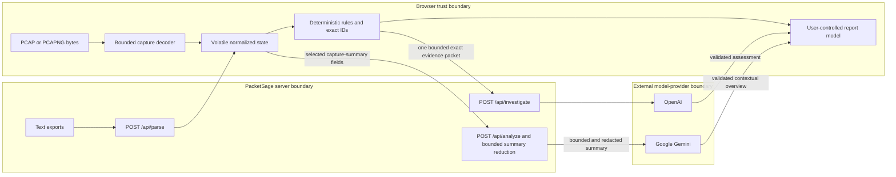
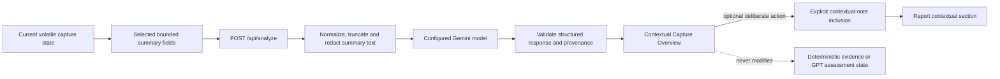

# PacketSage Security & Privacy Model

This document describes the shipped security, privacy and trust boundaries of PacketSage at production tag `build-week-stage-4a.2-production`. It is a technical control description, not a certification or guarantee about external providers.

> Active evidence, assessment, report and investigation state is volatile and clears when evidence is replaced or the session is reloaded. Limited interface preferences may persist locally. Hosting and model-provider retention policies remain external to PacketSage.

## 1. Scope and non-goals

This model covers PacketSage's evidence-processing paths, model boundaries, volatile browser state, report inclusion controls and operator-facing assurances. It does not certify the hosting environment, model providers, imported evidence, legal admissibility or an operator's compliance obligations.

The governing principle is:

> Observed evidence, deterministic derivation, external context and AI inference remain visibly separate.

## 2. Authorized defensive use

PacketSage is a passive workspace for authorized network-evidence review.

- Operators must confirm they own the evidence or have explicit authorization to inspect it before importing non-sample data.
- The generated guided sample is synthetic defensive-analysis evidence and does not require an external evidence authorization.
- PacketSage does not capture live traffic, bind to a raw network interface, scan networks, probe ports, ping endpoints or take response actions.
- Imported traffic patterns and deterministic signals do not confirm malware, compromise, intent, command and control or data theft.

PacketSage is a security-focused developer and analyst tool, not an autonomous SOC, SIEM, enterprise forensic vault or court-certified chain-of-custody system.

## 3. Browser, server and model trust boundaries

PacketSage keeps capture decoding, text parsing and model requests separate.

### 3.1 Browser-decoded capture evidence

Raw PCAP/PCAPNG bytes are read and decoded in bounded browser memory. They are not uploaded to `/api/parse`, `/api/investigate` or `/api/analyze`. PacketSage computes a SHA-256 value for imported capture bytes where supported, but that checksum does not provide acquisition controls, custody history or collision impossibility.

Malformed, truncated, unsupported and oversized captures fail without fabricated events. The browser decoder is capped at 10 MiB and 20,000 packet records.

### 3.2 Server-parsed text evidence

Supported Wireshark CSV, Suricata EVE JSON, Zeek TSV/log, TShark JSON and strict structured-text content is sent to `/api/parse`. The server enforces request, text, record, filename, schema and port-provenance bounds before returning normalized evidence. Raw capture mode is explicitly rejected by this endpoint.

The current text boundary is 2,000,000 characters, with a 3 MiB request-body limit and at most 10,000 records in any parsed collection. These bounds reduce accidental or hostile resource amplification; they do not make arbitrary evidence safe outside the supported adapters.

### 3.3 Model routes

Model requests are separate, deliberate actions. They do not run during parsing or deterministic signal generation.

- `/api/investigate` accepts one validated, bounded packet for one selected deterministic signal.
- `/api/analyze` accepts one separately bounded whole-capture summary for optional orientation.
- `OPENAI_API_KEY`, `GEMINI_API_KEY` and optional model configuration remain server-only.
- The browser cannot select the OpenAI provider/model or supply a credential through the investigation schema.
- Provider and hosting retention policies apply after bounded data crosses their respective boundaries.

## 4. Data minimization by structure

PacketSage relies first on structural data minimization, not on trying to scrub an unrestricted packet dump.

Normalized events, flows, DNS/HTTP/TLS records and deterministic signals receive stable application identities. Relationships are created only through parser-established IDs. Shared IP addresses, prose, protocol names, severity and list position never create relationships. Missing IDs remain missing; navigation does not fall back to an unrelated record.

Explicit port provenance prevents an absent transport port from being presented as an observed numeric zero:

| State | Trust meaning | Rendering |
| --- | --- | --- |
| `observed` | Numeric value appeared in decoded or supplied evidence, including zero | `10.0.0.15:443`, `10.0.0.15:0` |
| `unknown` | A port could exist, but the source omitted it | `10.0.0.15:unknown` |
| `not-applicable` | The record has no transport port | `10.0.0.15` |

Port provenance participates in display, grouping and identity where zero would otherwise be ambiguous.

### 4.1 Report inclusion integrity

Report Builder compiles one shared deterministic model for Preview, Markdown and Print/PDF. A deterministic signal enters only after **Add finding to report**. A retained GPT assessment defaults to excluded and requires explicit inclusion. A retained Capture Overview also defaults to excluded and requires a separate contextual-note inclusion. The overview cannot make a report evidence-ready, and PacketSage never attaches GPT-style citations to Gemini output.

The report discloses its draft status, evidence identity, checksum state, generation time/timezone, exact relationships, AI provenance and limitations. It is an investigation aid, not proof of attribution, legal admissibility or chain of custody.

## 5. GPT investigation boundary

Evidence-grounded Investigation uses OpenAI model `gpt-5.6-sol` through the server-only `/api/investigate` route. It receives:

- one deliberately selected deterministic signal;
- only the signal's exact referenced flows;
- only events referenced by those included flows;
- only DNS, HTTP and TLS records explicitly linked to the included events;
- explicit port provenance and truncation flags;
- no raw PCAP/PCAPNG bytes;
- no packet payloads, raw summaries or packet `info` fields;
- no unrelated capture records.

The packet is capped at 128 KiB, 25 flows, 200 events and 50 combined protocol records. Text fields, IDs and output item counts are also bounded. Truncation retains internally consistent relationships: flow references are filtered to included events, protocol records must reference included events, and the server rejects orphaned or inconsistent relationships.

The OpenAI request uses strict structured output, `store: false`, a 45-second timeout and a fixed server-selected model. `store: false` controls OpenAI response storage for this request; it is not a promise that every infrastructure or provider log has zero retention.

### 5.1 Citation integrity and trust separation

The response schema separates summary, observed evidence, inference, uncertainty and next steps. Every observed-evidence or inference citation is intersected with the exact evidence-ID set supplied in the packet. Unsupported IDs are removed without substitution; a statement with no retained citation is not rendered as observed evidence or inference.

The model cannot change normalized evidence, deterministic findings or exact relationships. It cannot automatically add an assessment to the report. Failures do not produce canned findings, stale prior assessments or fabricated local fallbacks.

## 6. Gemini Capture Overview boundary

Capture Overview is optional whole-capture orientation, not evidence-linked investigation. It receives a separately bounded summary of up to 15 flows, 20 DNS records, 10 HTTP records, 10 TLS records, 20 deterministic signal summaries and 12 protocol statistics. The request is limited to 180,000 characters before reduction; individual summary text fields are normalized, truncated and passed through targeted credential-pattern redaction on the server.

This redaction is defense in depth for already selected summary fields. PacketSage does not claim a generic browser-side redaction controller or that arbitrary sensitive content can safely be uploaded to a model route.

Capture Overview uses the configured server-side Gemini model, and each retained result records its actual provider and model provenance. The configured list and fallback candidates may change; one permanent Gemini model identifier is not an architecture guarantee.

The overview:

- is citation-free and contextual;
- cannot create or modify deterministic findings;
- is not merged into GPT assessment state;
- is never labelled observed evidence or model consensus;
- requires a separate **Include overview as contextual note** action before entering a report;
- is cleared when evidence changes;
- uses request cancellation and capture identity checks so an older response cannot overwrite the current case;
- fails with an honest retry state and no fabricated fallback.

### 6.1 Model provenance

Every retained completed model result records:

- schema version;
- provider;
- actual model identifier returned or selected by the server path;
- generation state;
- creation time;
- evidence, capture or deterministic packet identity;
- explicit report-inclusion state.

Capability-based labels remain primary in the interface. Provider/model details are disclosed through technical details and report provenance rather than presented as product consensus.

## 7. Credentials and browser bundle

Server credentials are configured as `OPENAI_API_KEY` and `GEMINI_API_KEY`. Optional `GEMINI_MODEL` is also server-side. They must never use `VITE_` prefixes, because Vite-prefixed values are eligible for browser bundling. `VITE_APP_ENV` is the only documented browser environment label.

The production browser bundle must contain no OpenAI or Gemini credential value, credential signature or server-only credential name. Repository and release verification should include a browser-bundle credential scan without printing any detected value.

## 8. Volatile state and retention caveats

Active evidence, signal-review overrides, generated assessments, Capture Overview, report details, inclusion state and exact-navigation scope live in the current browser session. They clear when evidence is replaced, **Clear current evidence** is confirmed, or the page is reloaded.

Theme and guided-tour completion preferences may persist in browser local storage. PacketSage currently has no user accounts, durable case database, server-side case archive, shared workspace or collaboration history.

Hosting access logs, function telemetry, model-provider processing and provider retention are external to PacketSage. Deployment owners must configure and review those systems under their own policies.

## 9. Cancellation, stale-response isolation and safe failure

The browser binds each investigation request to a monotonic request ID, selected signal ID and deterministic packet identity. `AbortController` cancels invalidated work. Duplicate requests for the active context are blocked, and a completion is accepted only if all identities still match the current investigation. Switching signals, changing evidence, retrying or receiving out-of-order responses cannot display another signal's result.

Capture Overview similarly permits one active request, cancels work when capture identity changes, and accepts a response only when its sequence and capture identity remain current. Both servers relay client cancellation and apply bounded timeouts.

The application enforces file, request, packet, record, relationship, text, output and timeout bounds. Malformed requests return a 4xx response where possible; upstream and internal failures return bounded client-safe messages. Decoder and API errors do not reflect raw payloads, capture bytes, provider errors, stack traces, credentials or environment details. No AI failure creates canned or fabricated findings.

## 10. Operator responsibilities

- Import only evidence the operator is authorized to inspect.
- Minimize secrets, personal data and irrelevant content before importing evidence.
- Configure server credentials only in the deployment's protected secret store.
- Review hosting and provider retention, access and logging policies.
- Treat deterministic signals and model output as investigative leads requiring independent validation.
- Restrict exported reports according to the sensitivity of their source evidence.
- If credential exposure is suspected, stop processing, restrict access, inspect authorized logs and rotate the credential through its provider—not through PacketSage source code.

## 11. Known risks and limitations

These controls reduce memory/CPU amplification and accidental disclosure, but PacketSage is not a general-purpose sandbox for arbitrary parsers. Unsupported link layers and protocols fail or remain unsupported rather than being heuristically interpreted.

PacketSage has no authentication, durable case database, shared workspace, enterprise retention controls or built-in provider-policy enforcement. Active state can be lost on reload. Bounded normalized metadata may still be sensitive, and a model may still produce an incorrect inference despite schema and citation validation. Operators must assess those risks for their evidence and deployment.

## 12. Claims PacketSage deliberately does not make

PacketSage documentation and output must not claim:

- malware detection or compromise confirmation;
- intent, attribution, command and control or data theft from packet metadata alone;
- complete protocol dissection, decryption, stream reassembly or payload reconstruction;
- automatic report authorship by either model;
- zero retention across hosting or model providers;
- guaranteed privacy, collision impossibility or perfect security;
- legal admissibility, audit certification or chain-of-custody compliance;
- authentication, durable cases, collaboration, SIEM integration or enterprise response automation.

Analysts remain responsible for authorization, independent validation, provider configuration and any decision made from PacketSage output.
