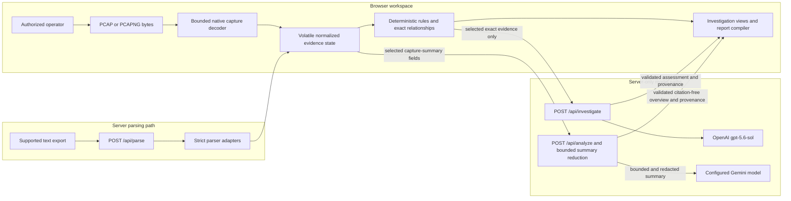
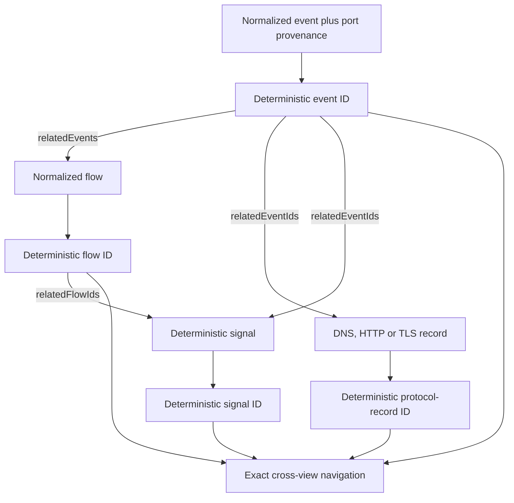
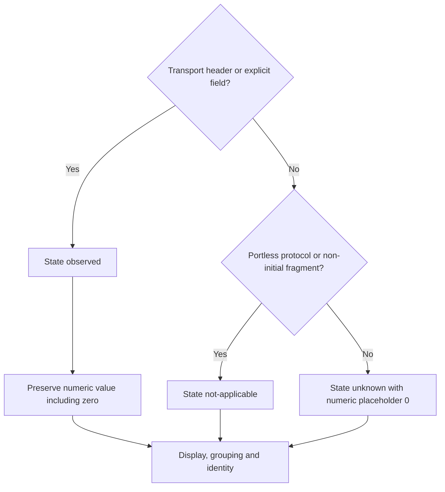
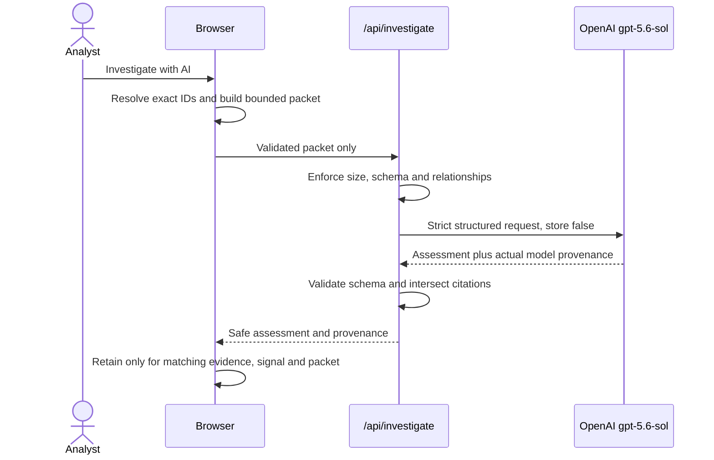
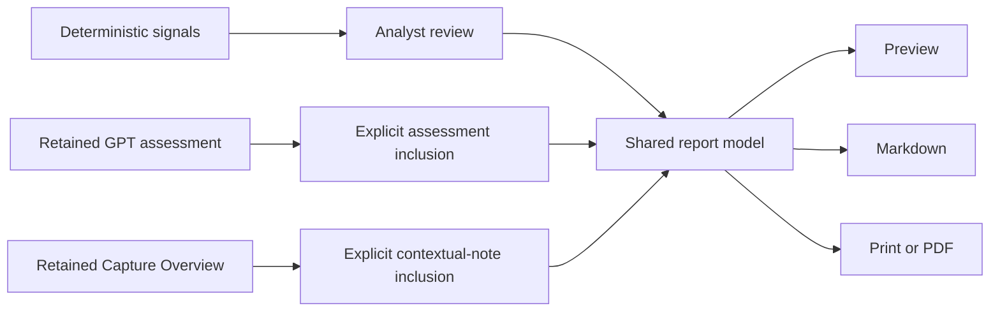

# PacketSage Technical Specification

This specification describes the shipped PacketSage production baseline at tag `build-week-stage-4a.2-production` and commit `e2d13e59c4fbf8f32e687110af3a91386af5d2ee`. It documents implemented behavior, not a commitment to future infrastructure.

PacketSage is an evidence-grounded network investigation workspace that helps analysts use AI without allowing inference to masquerade as observed fact.

## 1. Runtime architecture

PacketSage is a React 19 and TypeScript workspace built with Vite. Tailwind CSS 4 supplies the tokenized visual system, `motion` supplies bounded interface transitions, and `lucide-react` supplies icons. An Express development/production server and Vercel serverless functions expose the parsing and model routes.

The architecture deliberately keeps three processing paths distinct:



Raw capture bytes remain in browser memory. Supported text exports are sent to `/api/parse`. Model calls use separate server-only routes and derived, bounded data; neither route receives raw capture bytes or packet payloads.

## 2. Normalized evidence model

The canonical interfaces live in `src/types.ts`.

- `UploadedEvidence` records evidence identity, source format, parse mode, status, size, retention wording and checksum state.
- `PacketEvent` records time, endpoints, explicit port provenance, protocol, observed lengths and a bounded decoded description.
- `FlowSummary` groups normalized endpoints and protocol state, with counts, timing, direction, risk label and exact `relatedEvents` IDs. Portless flows are valid and are not described as five-tuples.
- `DnsRecord`, `HttpRecord` and `TlsRecord` may carry stable IDs and explicit `relatedEventIds`.
- `SuspiciousSignal` separates observed evidence, deterministic interpretation, limitations and a recommended defensive check. Its relationships are exact event and flow IDs.
- `InvestigationRecord` and `CaptureOverviewRecord` retain schema version, provider, actual model identifier, generation state/time, evidence or capture identity and report-inclusion state.

### 2.1 Deterministic identity and relationships

After parsing, `finalizeEvidenceIds` canonicalizes identity inputs and assigns stable event, flow, protocol-record and signal IDs. Repeated identical records receive occurrence indexes, so duplicates remain distinct while decoding the same ordered evidence produces stable identities. Port provenance participates in identities where a numeric zero would otherwise be ambiguous. This is deterministic application identity, not a claim of cryptographic collision impossibility or chain of custody.

Relationships are parser-established and ID-based:



Shared IP addresses, prose, protocol names, severity, display order and temporary identifiers never create navigation relationships. Missing IDs yield unavailable or empty states; PacketSage does not substitute an unrelated flow.

### 2.2 Explicit port provenance

Every event and relevant flow records one of three states for each endpoint port:

| State | Meaning | Example rendering |
| --- | --- | --- |
| `observed` | The numeric transport port was supplied or decoded, including literal zero | `10.0.0.15:443` or `10.0.0.15:0` |
| `unknown` | A transport port could exist but the source did not supply it | `10.0.0.15:unknown` |
| `not-applicable` | The record has no transport port | `10.0.0.15` |

IPv6 endpoint rendering brackets addresses when a port or `unknown` suffix is present. Canonical IPv6 formatting uses lowercase hexadecimal, removes hextet-leading zeroes, and compresses the leftmost longest run of at least two zero hextets.



Numeric zero never universally means unknown.

## 3. Evidence input paths

### 3.1 Guided sample

**Load guided investigation sample** loads a generated defensive-analysis fixture through the same normalized evidence state used by imported evidence. It contains routine and review-worthy activity but does not assert intrusion or host compromise.

### 3.2 Browser-decoded captures

`.pcap` and `.pcapng` files are decoded in bounded browser memory. The implemented decoder supports Ethernet and raw-IP link types, IPv4 and IPv6, TCP, UDP, ICMP/ICMPv6, non-initial fragment representation, and basic DNS metadata. It handles PCAP/PCAPNG container byte order, interface references and timestamp resolution through the capture parser.

Unsupported link types or network protocols do not create synthetic evidence. Empty, malformed, truncated, unsupported or oversized captures fail with bounded messages. PacketSage does not provide TCP stream reassembly, decryption, payload reconstruction, full protocol dissection or host-compromise confirmation.

### 3.3 Server-parsed text evidence

`POST /api/parse` accepts only validated requests and dispatches to these adapters:

- Wireshark CSV;
- Suricata EVE JSON lines;
- Zeek TSV/log exports;
- TShark JSON from `tshark -T json`;
- strict structured text.

The strict text grammar accepts one event per line:

```text
<UTC ISO-8601 timestamp> <source IPv4> -> <destination IPv4> [src_port=<0-65535>] dst_port=<0-65535> protocol=<TCP|UDP> length=<0-65535>
```

The timestamp, IPv4 endpoints, destination port, protocol and length are required. Source port is optional and becomes `unknown` when omitted. Unknown, duplicate or malformed fields fail the request with line-specific errors; no partial result is returned.

### 3.4 Enforced limits

Values in this table come from the production runtime constants.

| Boundary | Enforced limit |
| --- | ---: |
| Browser capture size | 10 MiB |
| Browser-decoded packets | 20,000 |
| Text evidence | 2,000,000 characters |
| Parsed records per collection | 10,000 |
| File name | 255 characters |
| Server parse request body | 3 MiB |
| Investigation packet | 128 KiB |
| Investigation flows | 25 |
| Investigation events | 200 |
| Investigation protocol records, combined | 50 |
| Investigation text field | 2,000 characters |
| Investigation ID | 160 characters |
| Items per assessment section | 20 |
| GPT investigation timeout | 45 seconds |
| Capture Overview request | 180,000 characters before reduction |
| Capture Overview summary | 15 flows, 20 DNS, 10 HTTP, 10 TLS, 20 signals, 12 protocol statistics |
| Capture Overview timeout across configured/fallback attempts | 45 seconds |
| Report timeline | 100 events |

The body, schema and collection checks are cumulative controls. Truncation flags in the investigation packet disclose when related flows, events or protocol records were bounded.

## 4. Evidence-grounded Investigation

Evidence-grounded Investigation is a deliberate selected-signal action. The browser constructs one packet from the signal's exact `relatedFlowIds`, the referenced flow events and only protocol records explicitly linked to those included events.

The packet includes one deterministic signal, at most 25 flows, 200 events and 50 combined DNS/HTTP/TLS records. Event `info`, raw summaries, capture bytes and packet payloads are structurally absent. Unrelated capture content is not sampled to fill unused capacity.

`POST /api/investigate` validates the complete request schema and internal relationships, then calls OpenAI model `gpt-5.6-sol` through the Responses API with strict JSON-schema output, `store: false`, low reasoning effort and a 2,500-token output limit. The returned provider and actual model identifier are validated and retained with the result.



Validated output is rendered as:

- Assessment summary;
- Observed evidence;
- Analyst inference;
- Uncertainty / missing evidence;
- Recommended next investigative steps.

An observed-evidence or inference item survives only when it retains at least one citation from the supplied evidence-ID set. Unsupported IDs are removed without substitution. The model cannot modify normalized evidence or deterministic signals, and no fabricated local fallback appears after failure.

### 4.1 Request isolation

Investigation requests use a monotonic request ID, signal ID, deterministic packet identity and `AbortController`. Starting a different request invalidates the prior request; duplicate active requests for the same context are blocked. A completion is accepted only if its request, signal and packet identities still match the active context. Cancelled, stale, duplicate, retried and out-of-order responses are ignored rather than displayed in a different investigation.

The server relays client disconnects to the provider request and enforces its own timeout. Validation, upstream, timeout and malformed-output failures return bounded client-safe errors without raw provider errors, stack traces, environment details, credentials or packet content.

## 5. Capture Overview

Capture Overview is an optional whole-capture orientation capability, separate from Evidence-grounded Investigation. `POST /api/analyze` receives a capture identity and a bounded client summary. The server normalizes and truncates selected fields, applies targeted credential-pattern redaction to bounded text, and sends only that reduced summary to the configured server-side Gemini model.

`GEMINI_MODEL` may provide an ordered configured model list; the server retains the actual successful provider and model with the result. Fallback candidates are implementation choices, not permanent product guarantees. Canonical architecture wording is:

> Capture Overview uses the configured server-side Gemini model, and each retained result records its actual provider and model provenance.

The response schema requires orientation, traffic-pattern explanation, beginner and technical perspectives, triage questions, recommended checks, confidence and limitations. It is citation-free, cannot create or modify deterministic findings, is never merged into GPT assessment state and is never presented as observed evidence or model consensus.

The browser maintains one active overview request, aborts it when capture identity changes or the component unmounts, and accepts a response only when both its request sequence and capture identity remain current. Failure produces an honest retry state with no fabricated fallback.

## 6. Report lifecycle

Report Builder compiles one shared deterministic model consumed by on-screen Preview, Markdown and Print/PDF.



- Deterministic findings enter only after **Add finding to report**.
- Completed GPT assessments default to excluded and require a separate explicit inclusion action.
- Capture Overview defaults to excluded and requires **Include overview as contextual note**.
- A contextual overview cannot make a report evidence-ready and is labelled as non-evidence-linked.
- Report output discloses evidence identity, checksum state, exact finding relationships, assessment citations and model provenance where available.

The report is a draft investigation aid, not a chain-of-custody system or court-certified forensic product.

## 7. Volatile state and routes

Active evidence, signal-review overrides, assessment records, Capture Overview, report details, inclusion state and exact-navigation scope live in the current React session. Replacing evidence or clearing the case resets that state; page reload also clears it. Theme and guided-tour completion preferences may persist in local storage.

The active workspace routes are Command center, Import evidence, Flow explorer, Protocol intelligence, Signals & observations, Capture overview, Incident timeline, Report builder, Packet Academy, and Architecture spec. The Architecture spec is evidence-independent. At narrow widths, a labelled keyboard-operable menu exposes every active route.

## 8. Build and deployment

Local development runs Express with Vite middleware:

```bash
npm run dev
```

The development and bundled Express server binds to `0.0.0.0:3000`. The production build creates the browser bundle, bundled Express server and parser module:

```bash
npm run build
```

Equivalent build steps are:

```text
vite build
esbuild server.ts --bundle --platform=node --format=cjs --packages=external --sourcemap --outfile=dist/server.cjs
esbuild src/lib/parser.ts --bundle --platform=node --format=esm --outfile=dist/parser.mjs
```

`npm run start` launches `dist/server.cjs` for a conventional Node deployment. On Vercel, `api/health.ts`, `api/parse.ts`, `api/investigate.ts` and `api/analyze.ts` run as serverless functions while Vite assets are served from `dist`. The checked-in `vercel.json` uses `npm install`, `npm run build`, the `dist` output directory and a SPA rewrite; `/api/parse` includes the built parser module.

`OPENAI_API_KEY`, `GEMINI_API_KEY` and optional `GEMINI_MODEL` are server-only configuration. Credential names or values must never receive a `VITE_` prefix. Only `VITE_APP_ENV` is intended for browser exposure.

## 9. Verification

The frozen production baseline passed 333/333 tests. A new branch should run its current suite rather than assume the frozen count:

```bash
npm test
npm run lint
npm run build
npm audit
npm audit --omit=dev
```

`npm run verify:pdf` exercises the guided sample and validates a generated PDF for report markers, content and absence of application-shell labels.

## 10. Explicit non-capabilities

The current product does not implement authentication, durable cases, multi-user collaboration, SIEM integration, large-capture workers, progressive parsing, external intelligence enrichment, cross-capture correlation, enterprise chain-of-custody workflows or private/on-premise packaging. These are future possibilities, not hidden or partially shipped architecture.
