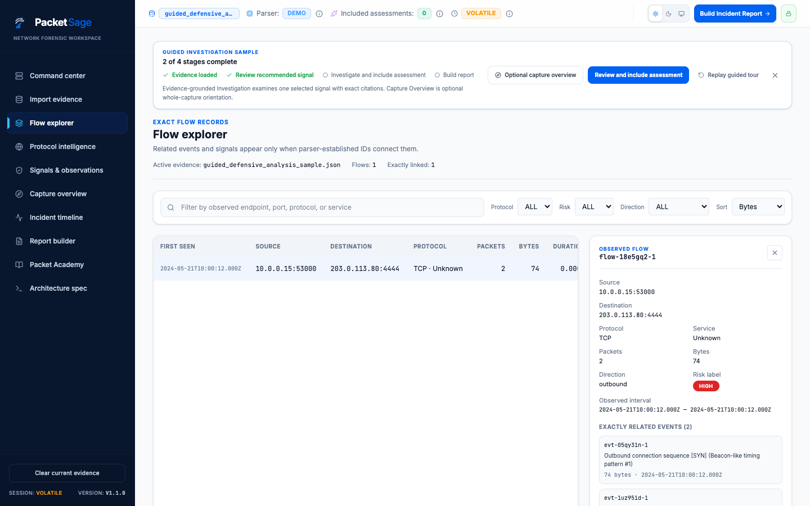
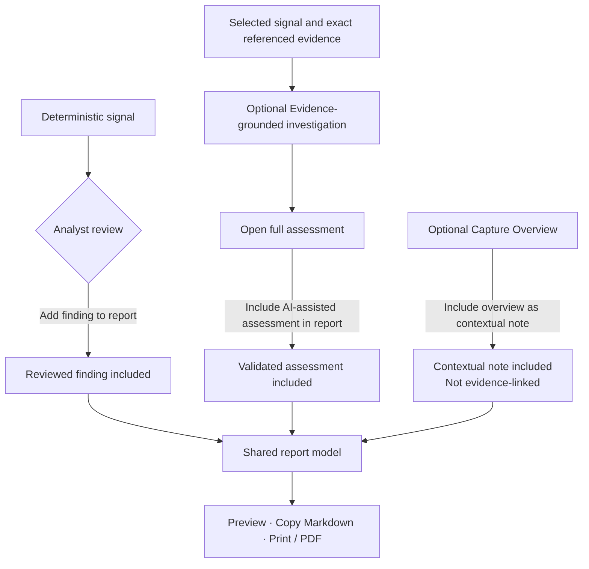
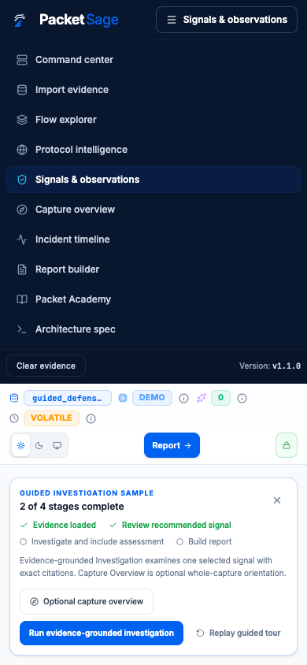

# PacketSage User Guide

PacketSage is an evidence-grounded network investigation workspace for authorized defensive analysis. It keeps observed evidence, deterministic derivation, contextual orientation, and AI inference visibly separate. Nothing generated by a model becomes observed evidence, and nothing enters a report automatically.

This guide follows the current production interface from evidence intake to a user-controlled report.

## 1. Start with the guided sample

The generated sample is the quickest way to learn PacketSage without uploading evidence or making an AI request.

1. Open **Import evidence**.
2. Find **Guided defensive-analysis sample**.
3. Select **Load guided investigation sample**.
4. Use the **Guided investigation sample** panel to move through the four-stage path. **Review recommended signal** opens the deterministic signal selected for the walkthrough.

The sample contains routine and review-worthy metadata. It does not establish an attack, compromise, or attribution. Running **Evidence-grounded investigation** and generating **Capture Overview** remain optional actions that may use configured paid model access; the guided tour does not require either action.


## 2. Import authorized evidence

Only import evidence that you are authorized to inspect. For user-provided evidence, first select:

> I confirm I’m authorized to inspect and upload these logs.

You can then drag a file into the import area, choose **Browse files to upload**, or use **Use paste mode**.

### Supported input paths

| Input | Processing path | Current support |
| --- | --- | --- |
| PCAP and PCAPNG | Decoded in bounded browser memory | Implemented Ethernet, IPv4/IPv6, TCP, UDP, ICMP, and basic DNS metadata paths |
| Wireshark CSV | Sent to the server parsing endpoint | Normalized event and protocol metadata supplied by the export |
| Suricata EVE JSON | Sent to the server parsing endpoint | Supported EVE event fields |
| Zeek TSV/log exports | Sent to the server parsing endpoint | Supported connection, DNS, and HTTP fields |
| TShark JSON | Sent to the server parsing endpoint | Supported frame, IP, transport, and basic protocol fields |
| Strict structured text | Sent to the server parsing endpoint | One validated IPv4 TCP/UDP event per line |

Raw PCAP/PCAPNG bytes are not uploaded to the text parser or sent to an AI provider. Text exports do leave the browser for parsing. PacketSage does not provide TCP stream reassembly, decryption, payload reconstruction, full protocol dissection, or host-compromise confirmation.

### Strict paste grammar

Enter one event per line, then select **Submit pasted logs**:

```text
YYYY-MM-DDTHH:mm:ssZ SRC_IP -> DST_IP [src_port=N] dst_port=N protocol=TCP|UDP length=N
```

Example:

```text
2026-07-21T12:00:00Z 10.0.0.15 -> 203.0.113.80 dst_port=4444 protocol=TCP length=128
```

The UTC timestamp, source and destination IPv4 addresses, destination port, TCP/UDP protocol, and byte length are required. Ports accept `0` through `65535`. An explicit zero is observed port `0`; an omitted source port is `unknown`. Invalid lines return line-specific errors and do not produce partial evidence.

## 3. Review Command Center

After evidence is decoded or parsed, **Command center** becomes the workspace summary. Check:

- the evidence name, load time, size, and normalized-event count;
- the **Case summary** totals for events, conversations, endpoints, protocols, deterministic signals, and cleartext observations;
- **Observed traffic activity** for decoded event or byte volume over time;
- **Signals requiring review** for a preview of deterministic observations;
- **Timeline preview** for the earliest normalized records;
- **Investigation status** for the next available workflow action.

Counts describe the loaded metadata. A signal, severity, or cleartext warning is a review prompt—not proof that malicious activity occurred.


## 4. Explore flows, protocols, signals, and Timeline

Use each view for a different question:

- **Flow explorer** groups normalized conversations and shows recorded endpoints, port provenance, direction, duration, counts, and exact related events or signals. Search and filter narrow the current dataset; a risk label is deterministic review guidance, not endpoint attribution.
- **Protocol intelligence** shows only decoded DNS, HTTP, and TLS metadata. A missing value is shown as not recorded rather than inferred.
- **Signals & observations** lists deterministic findings with severity, confidence, observed evidence, exact relationships, and defensive checks. Filters do not create or change findings.
- **Incident timeline** reconstructs normalized chronology. Search, time, protocol, service, source, and sort controls affect only the displayed records. Selecting an event opens its beginner-readable description, evidence preview, exact related flows, and related observations.

Cross-view relationships use exact normalized IDs. PacketSage does not substitute another flow or event when a referenced record is unavailable.

Open **Architecture spec** at any time, including before loading evidence, to inspect the implemented processing paths, enforced limits, shipped Build Week stages, and explicitly unimplemented future systems.

### Endpoint and port meaning

| Display | Meaning |
| --- | --- |
| `10.0.0.15:443` | Port `443` was observed |
| `10.0.0.15:0` | Literal port `0` was observed |
| `10.0.0.15:unknown` | A transport port was applicable but omitted or unknown |
| `10.0.0.15` | The protocol has no applicable transport port |

## 5. Select and review a signal

1. Open **Signals & observations**.
2. Select a signal row to open its detail drawer.
3. Read **Observed evidence**, the plain-language explanation, exact related IDs, and recommended defensive checks.
4. Independently validate the observation. Use **Add finding to report** only for a finding you have reviewed, or **Dismiss noise** when appropriate. **Reset finding status to 'Needs review'** reverses either decision.

Signal review state and AI-assessment inclusion are separate. Adding a deterministic finding does not run AI or include an assessment.

## 6. Run optional Evidence-grounded Investigation

For a selected signal with valid exact references:

1. Find **Evidence-grounded investigation** in the signal drawer.
2. Select **Investigate with AI**.
3. Wait for the bounded request to complete; the loading state prevents duplicate requests.

The request contains one deliberately selected deterministic signal and only its exact referenced flows, events, and supported protocol records. It includes no raw capture bytes, packet payloads, or unrelated capture content. The production route uses OpenAI `gpt-5.6-sol`, records model provenance, validates a strict response schema, and accepts citations only from IDs in the supplied evidence packet.

If the signal has no valid referenced evidence, the action remains unavailable. An investigation failure displays **Retry**, retains no fabricated fallback assessment, and exposes no raw provider error.

## 7. Inspect the full assessment and exact citations

After a successful investigation, select **Open full assessment**. Review the labelled sections separately:

- **Assessment summary**;
- **Observed evidence**;
- **Analyst inference**;
- **Uncertainty / missing evidence**;
- **Recommended next investigative steps**.

Inference and uncertainty remain unconfirmed even when they cite evidence. Under **Referenced evidence**, select a cited flow or event ID to open only that exact current record. Unsupported citations are removed without substitution; unavailable retained references remain visibly unavailable.

Use **Technical details and model provenance** to inspect the provider, model, schema version, generation time, evidence identity, and packet identity retained with the assessment.



## 8. Explicitly include an assessment

In the full assessment workspace, select **Include AI-assisted assessment in report**. The state changes to **Included in report**, and the report can now render that retained assessment with its validated citations and provenance.

Use **Remove AI-assisted assessment from report** to reverse the choice. Inclusion does not confirm an inference, change deterministic evidence, or automatically navigate away from the assessment.

The three report inputs remain independent:



## 9. Build, preview, copy, and export the report

Select **Build Incident Report** in the workspace header or open **Report builder** from the navigation.

1. Add the available investigator and case/reference details. The optional scope/notes field is contextual report text, not observed evidence.
2. Confirm that reviewed deterministic findings, explicitly included assessments, and any contextual overview appear in separate sections.
3. Check **Report readiness**. It is guidance based on included content, not a claim that an investigation is complete or court-ready.
4. Select **Preview** to inspect the shared report model in a keyboard-contained dialog.
5. Select **Copy Markdown** to copy the same report model. If browser clipboard permission is denied, PacketSage reports the failure and allows a retry.
6. Select **Print / PDF** to use the browser print dialog. The print layout hides the application shell and keeps the report’s evidence, assessment, provenance, timeline, and limitations boundaries visible.

All three outputs consume the same bounded report model. The timeline section includes at most 100 events and states when additional events were truncated.


## 10. Use optional Capture Overview

Open **Capture Overview** when broad whole-capture orientation would help. Choose a perspective and select **Generate capture overview**. This is a separate, optional model request over a bounded summary—not the selected-signal evidence packet.

The overview:

- is contextual and citation-free;
- cannot create or modify deterministic findings;
- is never labelled observed evidence;
- does not merge with Evidence-grounded Investigation;
- records the actual provider, model, schema, evidence identity, generation state, and generation time;
- does not enter the report unless you select **Include overview as contextual note**.

Open **Technical details** to inspect the retained provider and model. The configured server-side Gemini model may change, so the retained result—not a permanent model claim—is authoritative. On failure, PacketSage displays **Retry** and generates no local fallback.

## 11. Clear evidence and understand volatile state

Use **Clear current evidence** in the desktop workspace footer when you are finished. On the compact mobile navigation, the equivalent control is **Clear evidence**.

> Active evidence, assessment, report and investigation state is volatile and clears when evidence is replaced or the session is reloaded. Limited interface preferences may persist locally. Hosting and model-provider retention policies remain external to PacketSage.

Replacing or clearing evidence also invalidates prior AI results so an older response cannot overwrite the current case. Raw capture decoding remains browser-local; supported text evidence and deliberate AI requests follow their separate server paths.

## 12. Handle errors and limits

PacketSage rejects unsupported, malformed, truncated, or oversized input with bounded messages. It does not reflect raw packet payloads, stack traces, credentials, or environment details in normal API errors.

| Boundary | Current enforced limit or behavior |
| --- | --- |
| Browser capture | 10 MiB and 20,000 packets |
| Text evidence | 2,000,000 characters and 10,000 records |
| Text parser request body | 3 MiB |
| File name | 255 characters |
| Investigation packet | 128 KiB; up to 25 flows, 200 events, and 50 protocol records |
| Investigation response wait | 45-second server timeout |
| Report timeline | First 100 normalized events, with truncation disclosed |

When something fails:

- Confirm the evidence matches a supported format and remains within its boundary.
- For strict text, correct every line identified by the parser before resubmitting.
- For PCAP/PCAPNG, a “malformed, truncated, or unsupported” message can indicate an invalid container or an unsupported capture path; PacketSage does not attempt partial reconstruction.
- For AI routes, confirm the server has provider access and use **Retry**. A failed, cancelled, stale, or out-of-order request cannot populate a fallback or another signal’s assessment.
- If **Copy Markdown** fails, grant clipboard permission where appropriate and retry; the report remains available through **Preview** and **Print / PDF**.

PacketSage is a defensive analysis aid, not a replacement for source validation, endpoint telemetry, organizational policy, or analyst judgment.


